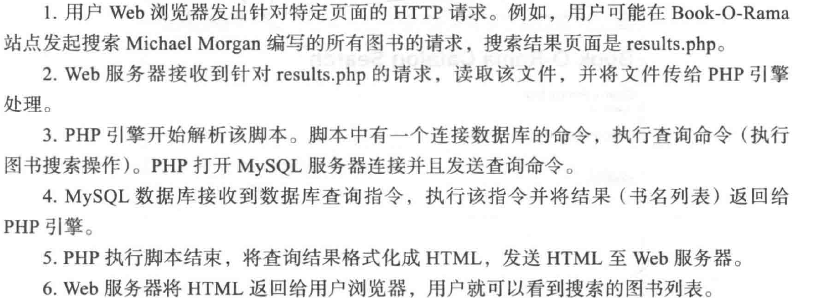

​		做这道题的时候我才发现，记忆这种事情真的一文不值。以前熟悉的东西，一段时间不接触，真的忘得一干二净。。。

​		我甚至连php如何连接MySQL都忘得一干二净！看见以前熟悉的mysqli，然后我会问自己，是这样子的吗？以前是这么连接的吗？

​		。。。。。。

​		我就很无奈，不知道说什么好。那反正知识点也不是很复杂，union查询啊什么的以前写过一篇，之后有需要再去复习。现在就先单纯的复习复习PHP连接Mysql，然后想想办法怎么解这道题吧。

```php
<?php
$servername = "localhost";
$username = "username";
$password = "password";
 
// 创建连接
$conn = new mysqli($servername, $username, $password);
 
// 检测连接
if ($conn->connect_error) {
    die("连接失败: " . $conn->connect_error);
} 
echo "连接成功";
?>
```

​		从《PHP和MySQL Web开发》开始复习吧，老早以前读过一遍，现在复习一小章应该也很快的。



​		这是一个典型的使用php和Mysql开发的web应用的流程。没啥好说的，看一遍就都理解了。

​		

​		这是从用户输入数据后，后端该做的事情。第一步是防sql注入的关键，或者说正确做出查询的关键。后面的2、3、4就是我想复习的内容，学习如何连接和使用MySQL数据库。

​		直接进入到第二步，第一步反正书上没什么内容，就是用个trim，可有可无。

```
$db = new mysqli('localhost','bookorama','bookorama123','books')
```

​		这是连接到某个数据库。第一个是IP或者MySQL服务器地址，第二个是用户名，第三个是用户密码，第四个是数据库的名称。	

```
$db->select_db(dbname)
```

​		通过这一步选择其它数据库。就相当于use dbname；

```
$query = "select * from books where $var = 123";
$db->query($query)
```

​		这就是典型的执行sql语句的方法。查询语句用双引号包含，输入的内容可以直接解析，当然这也是漏洞的来源，可以自由控制输入导致非预想的结果出现。

​		类似的，这道题，一般的登陆措施是怎样的呢（最最简单的那种，不考虑优化不考虑安全的）

```
$query = "select * from users where user = $user and passwd = $passwd";
```

​		然后通过判断$query是否为空，判断该用户是否在数据库内。

​		感觉复习的差不多了（^_^，随便看看，好快呀），那我们就来一步步揭秘这后面的sql查询，做了哪些限制，$query又是怎样的形式呢！

​		首先，仅仅使用用户名是不可取的，即使用户名用1'的形式，说明对参数的非空做了检查；

​		其次，1'的用户名，单引号会报错，然后用户名的地方使用and和or会发现都被过滤了。

​		