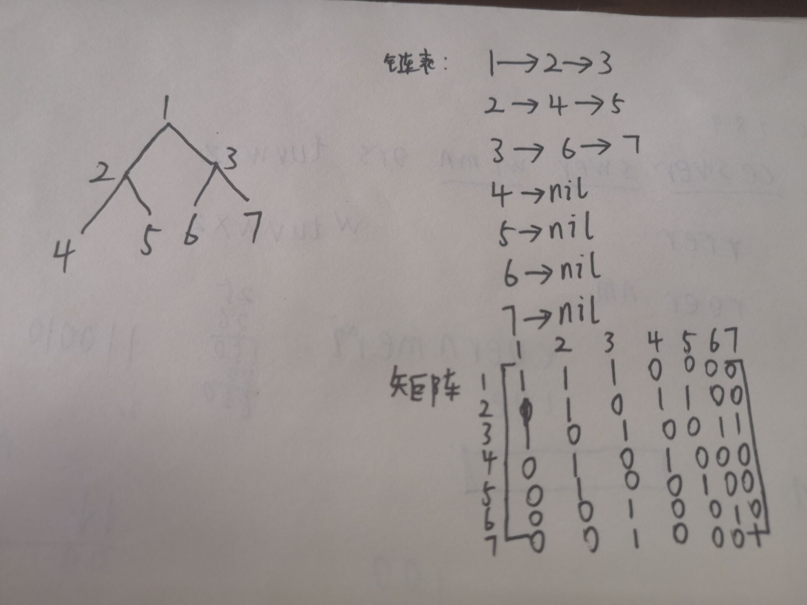

#### 思考题

##### 22.1-2 给定有向图的邻接链表，需要多长时间才能计算出每个结点的出度（发出的边的条数）？多长时间才能计算出每个结点的入度（进入的边的条数）？

​		出度好做，但是如何说明时间复杂度是多少比较困难。我觉得出度取决于对应节点链表的长度。但是每个节点的出度和入度时间是一致的，都是O(N+E)，即遍历完整个链表数组的时间。

##### 22.1-2 给定一棵有7个节点的完全二叉树的邻接链表，请给出等价的邻接矩阵表示。这里假设结点的编号为从1-7

​		练一练还是easy的^_^，这只是列出结构，手写还是比较轻松的

##### 22.1-3 有向图G = (V,E)的转置是图G^T=(V,E^T)，因此，图G^T就是将有向图G中所有边的方向反过来形成的图。对于邻接链表和邻接矩阵两种表示，请给出从图G计算出G^T的有效算法，并分析算法的运行时间。

​		对于邻接矩阵而言还是比较简单的。假设矩阵数组为A，则有向图的A\[i\]\[j\]表示边(i,j)，那么边进行反向就是把A\[i\]\[j\]与A\[j\]\[i\]进行交换，时间复杂度为n^2，也就是遍历整个矩阵所需的时间；

​		对于邻接链表而言，我的想法是新建一个新图的链表数组，不破坏原先的图结构，也更容易进行操作。比如上面的完全二叉树进行反转，那就是遍历每一条链表，比如1->2->3，然后对该链表的每一个结点，在新的链表数组上进行添加。如前文述，也就是在2结点上增加1和在3结点上增加1，直到遍历完全部链表。如果为空的那自然不用考虑，没有指向，反转了也是没有指向。时间复杂度为O(N+E)，空间复杂度也为O(N+E)，比起矩阵的O(1)要多消耗些空间。

##### 22.1-4 给定多图G=(V,E)的邻接链表（多图是允许重复边和自循环边的图），请给出一个时间为O(V+E)的算法，用来计算该图的“等价”无向图G'=(V,E')的邻接链表表示。这里E'是将E中的冗余边和自循环边删除后余下的边。删除冗余边指的是将两个节点之间的多条边替换为一条边。

​		大致给出个思路吧。相当于一条链表里有若干个重复节点，然后去掉重复节点。但是时间复杂度要求又是O(V+E)，也就是说在一次遍历的过程中，就要把冗余结点剔除出去。那么我能想到的只有哈希表，在每一条链表遍历之前建一个空哈希表，然后将结点加入进去，如果发现有记录就删除，没有就新增。

##### 22.1-7 有向无环图G=(V,E)的关联矩阵是一个满足下述条件的|V| X |E|矩阵B=(bij)

$$
b_{ij} = \left\{\begin{array}
--1 &    & 如果边j从结点i发出(i到j)\\
1 &    & 如果边j进入结点i(j到i)  \\
0 &    & 其它\end{array}\right.
$$

##### 请说明矩阵乘积BB^T里的每一个元素代表什么意思。这里B^T是矩阵B的转置。

​		=。= 下次这种数学题目手写了，再也不用markdown记录了，真麻烦。。稍微讲一下思路和想法吧。

​		题目有一点没说清楚，就是如果i=j，那我该写成什么值呢？当然，也不重要，因为i=j的情况都在对角线上，对角线矩阵相乘时没什么影响=。

22.2，广度优先搜索，我是一点也看不懂。。。这是广度优先搜索吗？感觉在用很多东西证明广度优先搜索和最短路径的关联，在证明其正确性，以后有条件再看吧=。=